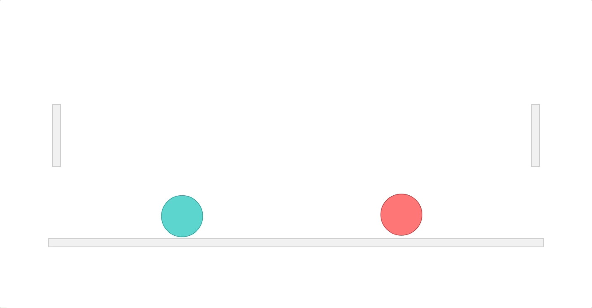

# Kablamo


## Playing instructions:

The goal is simple. Knock your opponent off the level.

The controls are intuitive. Use your mouse to control the ball, click to launch in a direction.

Have fun and [Go Kablamo!](https://zuhairs.github.io/Kablamo/)

## Now onto the technical stuff:

 - Kablamo's game structure and logic was made using just JavaScript, including the controls and AI.
 - The game is built utilizing the physics engine, [Matter.js](http://brm.io/matter-js/) to both render the objects as well as simulate semi-realisitic movements and hit reactions.

## Notable challenges:

#### Chase the mouse

I know I wanted to have a simple control that only required the intuitive use of a mouse to play. Code wise it involved checking the position of the mouse and the player ball and then trying to close that gap.

```
Events.on(mouseConstraint, "mousemove", event => {
  if (player.position.x > mouse.position.x) {
    Body.setAngularVelocity(player, -0.1);
  } else if (player.position.x < mouse.position.x) {
    Body.setAngularVelocity(player, 0.1);
  }
});
```

As for when exactly to move, my first implementation of that involved adding a event listener on `mousemove`. While it felt good when you were frantically moving about, new players who were less intent on doing so would get confused as to why the controls stopped responding.

In order to have a true _follow the mouse_ scheme, I switched the event listener to listen on every render of the engine. This ensured the ball always followed the mouse, regardless of other activity.

```
Events.on(render, "afterRender", event => {
  // control logic
});
```

There are still some kinks left to work out. The physical nature of the engine means the ball will always overshoot the mouse and start oscillation. It isn't particularly irksome currently, but having accurate controls can allow me to implement some smarter difficulty later on.

#### Super AI

The AI was _super_ fun to work with. Here are the simple decisions the AI will make,

- If the AI is far away from the player, it will try to close the gap by rolling towards the player.
- If the AI is close enough to the player **AND** the player is trying dash, it will try to dash into the player and knock them back. Otherwise it is content to just roll into the play and push them off the edge.

There were a few issues with this in regards to how the engine handles the events. Essentially, since the AI _technically_ does not require a floor to jump off of, after you knock the AI off the level, it would just come flying back when you would least expect it.



Ouch...

I ended up giving it bounds outside of which it should stop dashing.

I may bring it back as a bonus level.

## Future work:

There is still a lot more work to be done. Optimizations, features, etc, but here are some specific features that I'd like to implement:

- Allow camera to follow the player in order to allow larger levels.
- Allow enhanced slowmo launching on specific occasions.
- Add sound effects and music to game.
- Add Survival mode.
- Add enemy types.
