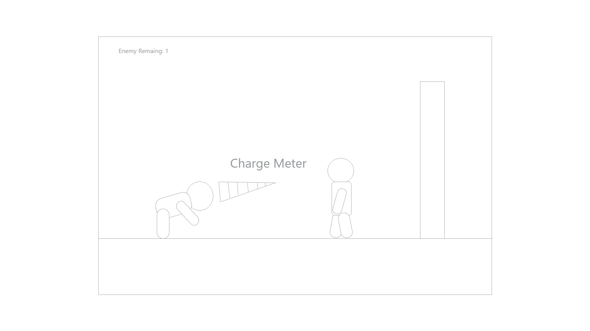
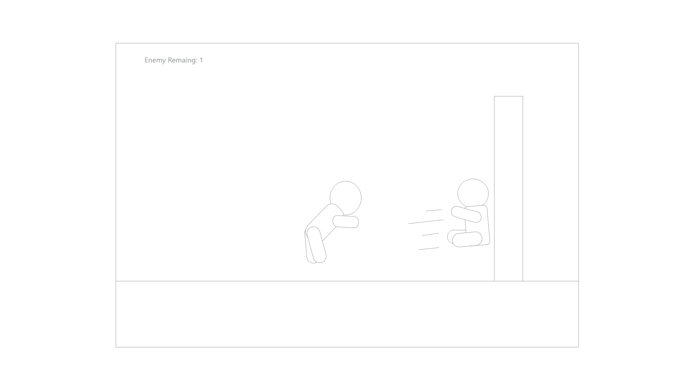
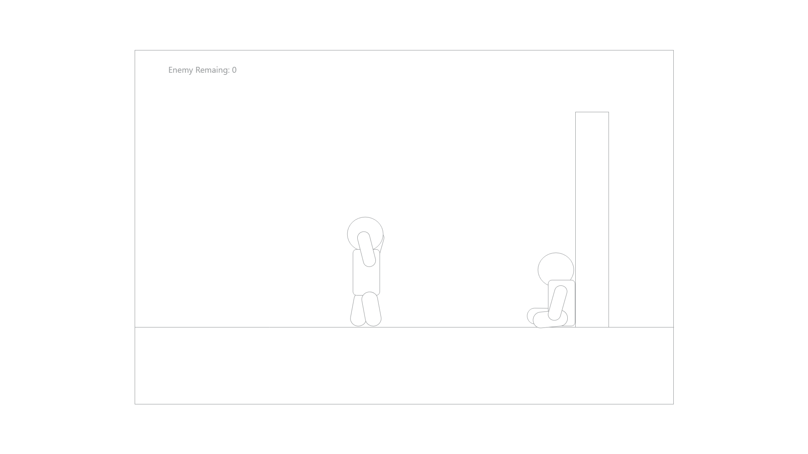

# Kablamo

## Background

Kablamo is intended to be an simple physics based action game with enjoyable impact based gameplay. The game is going to feature rounds in which our character is supposed to defeat all the onscreen enemies using themselves as a projectile. You damage enemies by smashing into them and in turn launching them into walls or other enemies. The focus is meant to be on the feeling of impact.

## Functionality & MVPs

While playing Kablamo, players will be able to:

- Read background and controls on the menu screen.
- Start, pause, restart the current level as well as choose different levels. (Bonus: A few game modes)
- Use arrow keys to move and use mouse to control the force and direction of their character's launch.
- Defeat enemies by hitting them into walls/enemies.
- Have enemies launch themselves onto the player to damage them.
- Have damage threshold after which the player loses.
- Have some progression with more enemies. (Bonus: Different types)
- (Priority Bonus) Be able to grab onto walls/enemies and launch again.

###### Kablamo will also have a production README.

## Wireframe

Kablamo should be a single screen app with a small window to play the game. Most of the game control interactions (start/pause/restart) should be done inside the game. The art in the game is supposed to be very simple, just enough to distinguish between different characters.

## Technologies

Kablamo is intended to be built on the following technologies:

- Vanilla JavaScript for game structure and logic.
- jQuery for DOM Manipulation.
- Easel.js with HTML5 Canvas for rendering.
- matter.js for physical reactions to impact.

## Implementation Timeline

**Day 1**: Learn the fundamentals of Easel.js and Physics.js in order to get a better understanding of future work.

**Day 2**: Create basic player character, basic controls and try to implement controlled physical launching. Have launched player pass on momentum onto hit object.

**Day 3**: Create rudimentary AI logic which uses the same launching ability as the player to hit the player. Add some randomization to their accuracy and force.

**Day 4** Create simple enclosed levels, create menu and spend rest of the time making the game look pretty.

## Bonus Features

- Add music to game.
- Add Survival mode.
- Add enemy types.
